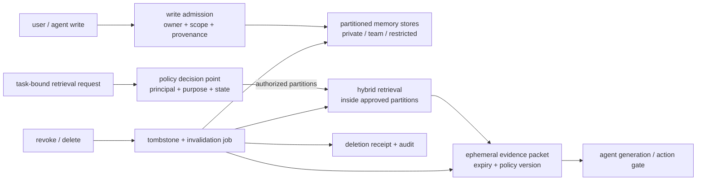
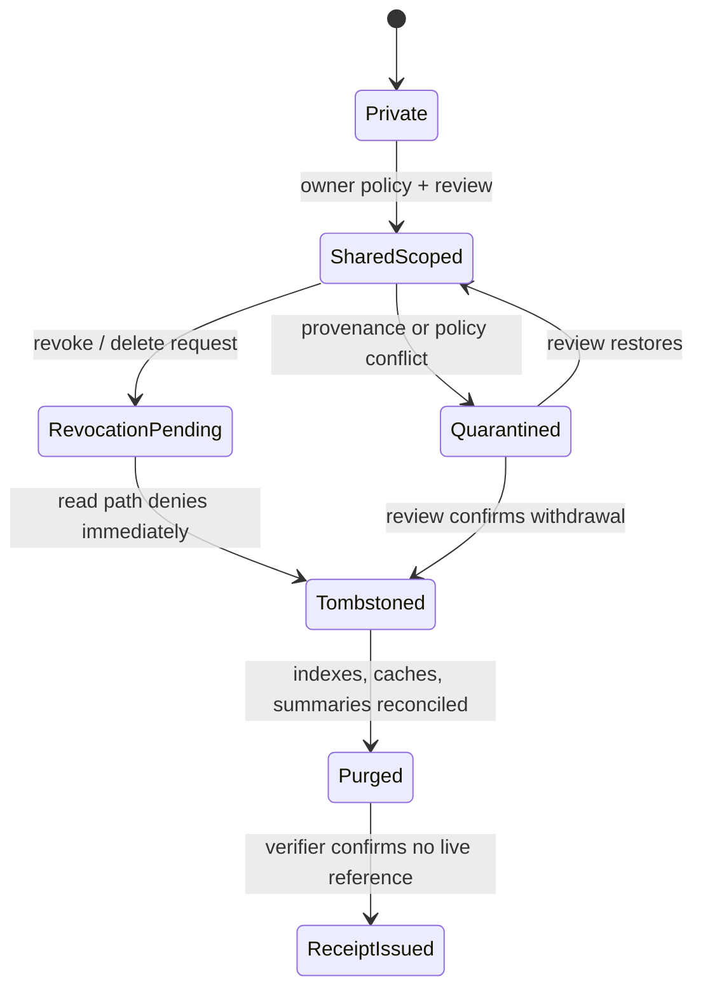

## 来源说明与本文边界

这篇文章讨论的是**多个主体共同写入、不同角色按情境读取**的 Agent 记忆，而不是单个用户的个人偏好库。主要依据有三类：

- [GateMem: Benchmarking Memory Governance in Multi-Principal Shared-Memory Agents](https://arxiv.org/abs/2606.18829)，2026-06-17 的预印本及其[官方评测实现](https://github.com/rzhub/GateMem)。GateMem 将共享记忆的能力拆成授权请求的可用性、跨情境授权边界的访问控制、收到删除请求后的主动遗忘；仓库当前发布 91 段多主体长轨迹、2,218 个隐藏检查点，并以 `MGS = U * (1 - A) * (1 - F)` 联合可用性 `U`、访问控制违规率 `A` 和主动遗忘失败率 `F`。这些是作者发布的 benchmark 定义与报告，不等同于生产环境的合规结论。
- [Multi-Agent Memory from a Computer Architecture Perspective](https://arxiv.org/abs/2603.10062)，2026-03 的 position paper。它把多 Agent 记忆区分为共享与分布式两种原型，提出 I/O、cache、memory 三层，并指出 cache 共享、结构化访问协议和一致性仍是缺口。这是一个架构视角，不是可直接部署的协议规范。
- [memX](https://github.com/MehulG/memX) 是一个小型开源共享状态层，使用 FastAPI、Redis、schema 校验、API key/ACL 与 pub/sub。它证明“共享状态服务”很容易搭出来，也正好说明本文的空白：能 `get/set` 和有 per-key ACL，并不自动得到任务级授权、撤销传播和主动遗忘。

站内已有文章讨论过目的绑定调解，即一个候选记忆应当 `withhold`、`abstract` 还是 `reveal`。本文不重复那层内容表达决策；本文关心更靠前和更靠后的系统问题：**查询计划必须先隔离哪些分区、授权失效如何立即生效、删除如何穿过向量索引、缓存与已发给 Agent 的证据包。** 下文的接口、状态机、策略和阈值均为我的工程建议。

## 先给结论

共享 Agent 记忆不能被当成“更多 Agent 共用的向量库”。它至少同时是：

1. **一个多主体数据池**：人、团队、服务账号和 Agent 都可能是 owner 或 requester；
2. **一个授权系统**：某条信息是否可读取取决于主体、角色、任务、用途、时间和当前组织状态；
3. **一个一致性系统**：撤销或删除之后，主记录、倒排索引、向量索引、检索缓存和已派发上下文必须趋于同一结论。

因此我会把共享记忆设计为下面的闭环，而不是 `query -> topK -> prompt`：



一句话版本是：**先按策略缩小能搜的空间，再做相关性排序；删除不是删一行，而是把“以后不能再取回或确认”的证明链做完整。**

## 技术问题：共享池里“回答正确”远远不够

假设一个办公室助手保存了项目状态、支持工单摘要、招聘讨论和个人日程。经理请项目 Agent 汇总风险，外包开发 Agent 调试一个模块，HR Agent 更新候选人流程。这些请求都可能使用同一套记忆基础设施，但它们的可见范围绝不相同。

最常见的实现错误有两个。

第一个错误是把 ACL 放在检索结果之后：先在整个集合做向量召回，再丢弃不允许的 chunk。这样即使最终不显示原文，候选数量、标题、chunk metadata、reranker 特征和缓存命中都可能泄漏；更现实的问题是，模型已经看过未过滤的候选时，后续 prompt 规则无法让它“没看见”。

第二个错误是把删除理解为主表的 `DELETE`。长期记忆会在多个位置留下派生物：embedding、关键词索引、图边、摘要、跨 Agent 的 evidence packet、HTTP/CDN cache、会话上下文和异步队列。只删源记录，之后仍可能从缓存或索引中恢复、甚至确认“那条内容曾经存在”。

GateMem 的价值恰恰在于把这两类失败和正常问答一起测。它要求系统同时回答授权问题、拒绝越权问题，并在显式删除后不再恢复或确认目标信息。作者报告的结论也很克制：多种基线没有同时做到高可用、强访问控制和可靠主动遗忘；长上下文有较好综合分数但 token 成本高，检索/外置记忆成本更低却仍存在越权或删除后的恢复失败。这个结果不告诉我们某个产品该怎么配，但它提醒了一件很工程化的事：**只优化召回率，可能使共享记忆更危险。**

| 目标 | 单用户记忆常见指标 | 共享记忆必须补上的问题 |
| --- | --- | --- |
| 有用 | recall、答案正确率、p95 延迟 | 对授权主体的任务是否仍然足够有用 |
| 保密 | tenant filter、API key | 角色、用途、委托链和组织变更后是否仍允许读取 |
| 遗忘 | 源文档删除成功 | 索引、缓存、摘要和已发证据是否停止再暴露 |
| 一致 | 最后写入获胜 | 撤销/删除在读路径上多久生效、能否审计 |

## 机制拆解：三平面，而不是一个 memory API

### 1. 记录平面：把“谁的、能给谁、处于什么状态”存进 record

一个共享 record 不能只含文本和 embedding。最小的有用模型应使 owner、资源边界、来源、保留状态可被服务端执行：

```ts
type SharedMemoryRecord = {
  id: string;
  tenantId: string;
  owner: { principalId: string; kind: "person" | "team" | "service" };
  resource: { kind: "project" | "case" | "workspace"; id: string };
  visibility: "private" | "team" | "restricted";
  sensitivity: "normal" | "confidential" | "restricted";
  purposeTags: Array<"support" | "engineering" | "planning" | "security">;
  contentRef: string;
  provenance: Array<{ eventId: string; observedAt: string; source: "user" | "tool" | "review" }>;
  lifecycle: "active" | "revocation_pending" | "tombstoned" | "purged" | "quarantined";
  policyRevision: number;
  createdAt: string;
};
```

这里的 `visibility` 只是分区线索，不是唯一策略；`purposeTags` 也不等于模型自己填写一句“为了调试”。服务端应该依据认证后的工作流、任务类型和资源引用生成可验证的 purpose，拒绝让 Agent 在请求体中伪造 `tenantId`、owner 或 scope。

### 2. 访问平面：以短期 capability 绑定一次任务

长期 API key 适合确认“哪个 Agent 接入了服务”，不适合确认“这一次读取是否为这个项目的这个任务所必需”。我会让编排器在任务创建时签发短期 capability，记忆服务只接受它而不是自然语言声明：

```ts
type MemoryCapability = {
  issuer: string;
  subjectAgentId: string;
  runId: string;
  resourceScopes: string[];
  purpose: "support" | "engineering" | "planning" | "security";
  actions: Array<"search" | "read" | "cite" | "write" | "request_delete">;
  expiresAt: string;
  policyRevision: number;
  nonce: string;
};
```

授权决策至少绑定 `authenticated agent + delegated principal + runId + resource scope + action + purpose + 当前 policy revision + lifecycle state`。这不是为了堆字段，而是防止四种很容易出现的错误：一个 Agent 持有旧授权继续读取、一个调试任务转而读取 HR 内容、一个被委托的 Agent 把原始内容转交给另一个 recipient、删除已开始但查询仍命中旧索引。



`RevocationPending -> Tombstoned` 必须先于异步 purge：读路径看见 tombstone 就拒绝，后台再清理派生物。否则系统会在“正在删除”的窗口继续把记录送入 prompt。

### 3. 生命周期平面：撤销、删除、证明是不同操作

撤销代表**某个主体或某类用途不再能访问**，record 本身可能因审计或法定留存仍存在。删除代表**按保留策略把内容及其可检索派生物清掉**。两者都应生成不可变审计事件，但审计日志只记录 id、事件、时间、策略版本、作业状态和哈希，不重新保存被删正文。

我会把删除作业建模成一张待完成清单：

```ts
type DeletionJob = {
  id: string;
  recordId: string;
  requestedBy: string;
  requestedAt: string;
  policyRevision: number;
  targets: Array<"primary" | "vector" | "keyword" | "graph" | "summary" | "retrieval_cache" | "evidence_packet">;
  status: "accepted" | "invalidating" | "verified" | "failed";
  evidence: Array<{ target: string; completedAt?: string; verifier: string; ref?: string }>;
};
```

`verified` 不能仅表示所有 worker 返回 200。它至少意味着：带已撤销 capability 的查询返回拒绝；使用原 query、同义 query 和已知 identifier 的回放不再得到该 record；缓存键和 packet 都因 `policyRevision` 或 tombstone 失效。对受法律留存约束的数据，删除请求可能变为“访问撤销 + 冷存保留”，必须在收据里明确，不能假装已经物理抹除。

## 工程判断：检索前裁剪比检索后过滤更关键

下面的差异看起来很小，安全语义完全不同：

```text
# 不够：所有分区召回后，再过滤结果
vector.search(query, all_records).filter(policy.allows)

# 更稳：策略服务先给出允许搜索的物理/逻辑分区
scopes = policy.authorizedPartitions(capability, request)
vector.search(query, partition=scopes, excludeLifecycle=[tombstoned, purged])
```

第二种不是说向量数据库自动解决访问控制。它要求存储键、索引 namespace、缓存键、rerank 输入和日志采样都带 tenant/resource/visibility 边界。更严格的部署可以让每个高敏资源使用独立索引或密钥；成本较低的部署至少要让所有 ANN 候选都在服务端受 scope 约束，且未经授权的 record 从不进入 reranker 或模型上下文。

多 Agent 记忆的架构论文把 cache 视为独立层，这一点在撤销时格外重要。不要共享“未经策略标记的 prompt 片段”。我会发送短命 evidence packet，而不是给每个 Agent 一个可随时回拉的原始 chunk 引用：

```ts
type EvidencePacket = {
  id: string;
  runId: string;
  policyRevision: number;
  expiresAt: string;
  items: Array<{ recordId: string; excerpt: string; provenanceRefs: string[]; allowedUse: "answer" | "draft" }>;
};
```

它有两个好处：一是 agent 只能看到任务所需的最小内容；二是撤销时可以按 `recordId` 或 policy revision 失效 packet，并要求 downstream 在执行动作前重新检查。它不是数字版权管理，无法让模型遗忘已经生成过的 token；但它能阻止系统继续把该内容作为后续行动依据，并留下可审计边界。

## 一个最小可运行方案

先不要从“全公司共享知识库”起步。选择一个有清楚资源边界的场景，例如研发团队的项目 runbook：每份 runbook 归属一个 project，默认私有，经过 maintainer 审核才成为 project-shared；跨项目访问需要显式 capability，生产事故条目默认 restricted。

目录可以保持很小：

```text
shared-memory/
  records/          # 主记录、provenance、lifecycle
  policy/           # 分区映射和 capability 校验
  retrieval/        # 先策略裁剪，再 hybrid search
  lifecycle/        # tombstone、purge workers、verification replay
  audit/             # append-only decision / receipt metadata
  tests/             # authorized, cross-scope, deleted, stale-cache fixtures
```

一条策略不应藏在 prompt 里：

```yaml
rules:
  - id: engineering-project-read
    when:
      purpose: engineering
      action: [search, read, cite]
      resource_scope: project
      lifecycle: active
    allow: true
  - id: deny-revoked-or-tombstoned
    when:
      lifecycle: [revocation_pending, tombstoned, purged]
    allow: false
  - id: restricted-needs-explicit-grant
    when:
      sensitivity: restricted
    require: explicit_resource_grant
```

一个 retrieval broker 的伪代码足以说明职责边界：

```ts
async function retrieve(request: RetrievalRequest, cap: MemoryCapability) {
  const decision = await policy.authorize(cap, request);
  if (!decision.allowed) return { items: [], denial: decision.reason };

  const candidates = await index.search({
    query: request.query,
    partitions: decision.partitions,
    excludeStates: ["revocation_pending", "tombstoned", "purged"],
  });

  const items = await policy.filterAndMinimize(candidates, decision);
  return packet.issue(items, { runId: cap.runId, policyRevision: decision.revision });
}
```

`policy.authorize` 和 `index.search` 之间不能反过来：检索组件没有权力扩大分区；生成 Agent 没有权力绕过 broker 直接拿存储凭证。需要保留人审的点也很具体：跨 team 分享、restricted 记录的用途变更、owner 不明确、删除与留存规则冲突、以及异常高频的拒绝/撤销。

## 可复制 SOP：一周内验证它是否真的工作

1. **画出主体与资源。** 只选两个 team、两个 project、一个 restricted 资源；为每条 fixture 标 owner、resource、用途、敏感度和预期生命周期。
2. **默认私有地接入写入。** writer 只能创建 `private` 或 `review_pending`，不能自行扩大到 team-wide。
3. **签发任务 capability。** 每次 retrieval 由编排器根据认证用户和 task 生成短期 token；测试过期 token、错误 project、错误 purpose 和委托链缺失。
4. **把分区裁剪接到搜索之前。** 为授权任务保留正常召回；对同义 query、模糊问法和 metadata 探测，确认跨 scope record 没进入候选集合。
5. **跑删除回放。** 写入一个可识别的合成 record，生成 embedding、摘要、缓存和 packet，再请求删除；用原 query、改写 query、record id、摘要片段和已撤销 token 回放。
6. **检查收据和告警。** deletion job 必须列出每一类派生物的状态；超时、失败、仍有 active cache key 或主索引命中时告警，不能静默标成功。
7. **再接真实数据。** 仅当合成 fixture 的越权读取和删除后恢复均为零，且授权任务没有明显误拒，才用经过审查的低敏项目资料小流量试运行。

## 可验证指标：不要只报一个“安全率”

GateMem 的乘法指标很有启发性：一个系统若授权问答很准、但泄漏率不为零，联合得分仍会被拖低。生产上我会保留拆开的原始指标，便于定位：

| 指标 | 计算方式 | 期望用途 |
| --- | --- | --- |
| Authorized utility | 授权任务的正确完成率 | 防止策略把系统锁死 |
| Access-control violation rate | 越权 fixture 中内容、metadata 或确认信息泄漏的比例 | 关键阻断指标 |
| Active-forgetting failure rate | 删除后通过原问法/改写/缓存回放仍恢复或确认目标的比例 | 关键阻断指标 |
| False denial rate | 本应授权的请求被拒绝的比例 | 找到过严 policy |
| Revocation convergence p95 | 从撤销请求到所有读路径拒绝的 p95 时间 | 观察一致性窗口 |
| Deletion job completeness | 已验证 targets / 应清理 targets | 防止 worker 静默遗漏 |
| Stale packet use | 已撤销 record 被 packet 用于后续 action 的次数 | 检查下游执行门 |
| Provenance coverage | 返回项可回链 owner/source/policy 的比例 | 支撑人工复核 |

可以把 GateMem 当作离线的外部参照，也应保留自己的二 team 合成集。后者必须包含组织角色变更、同名项目、被撤销的 delegated agent、缓存命中、删除中读请求和用途伪造，不能只用干净的“允许/拒绝”问题。

## 失败模式与处置

| 失败模式 | 为什么会发生 | 处置 |
| --- | --- | --- |
| ACL 放在 topK 之后 | 未授权候选已进入 rerank、日志或模型上下文 | 让 policy 输出可查询 partition，检索前裁剪 |
| Agent 自报 owner/purpose | 客户端字段不是可信授权事实 | 基于认证 identity 和任务编排服务端签发 capability |
| 删除只清源记录 | embedding、摘要、cache、packet 仍存活 | tombstone 先拒绝，异步清理后用 replay 验证 |
| policy 更新不影响旧缓存 | cache key 未含 policy revision | 版本化 key，更新或撤销时主动失效 |
| 共享工作流把个人事实带过去 | procedure 与原始 episode 混在一起 | procedure 只引用最小、经审查的去标识事实 |
| 审计日志反而保存敏感正文 | 为了可追踪直接复制 payload | 日志只保留 opaque id、哈希、决策与收据状态 |
| 删除与法定留存冲突 | “删除”被误承诺为物理抹除 | 返回明确的访问撤销/保留状态，交由数据治理负责人处理 |

## 局限分析

GateMem 是新预印本和离线 benchmark。它提供的是清晰的问题定义和可复核的评测工具，并不替代业务所属地的隐私、劳动、医疗或数据保留义务；实际授权语义仍需要法务、信息安全和数据 owner 一起定义。

Capability 也不是万能钥匙。token 被盗、编排器错误签发、模型从此前上下文推断敏感事实、下游系统把答案持久化，都不靠一个短期 token 自动解决。本文的核心主张不是“有 token 就安全”，而是让授权、检索、缓存和删除各自有可测试的执行点。

最后，主动遗忘无法让已生成的模型内部 token 神奇消失。工程上可承诺的是：从删除确认起，受控系统不再从持久层、索引、缓存或新证据包中恢复该数据，并能诚实报告仍受留存约束的副本。这已经比“删掉数据库一行”严格得多，也更接近真实可运营的边界。

## 自审

- **事实可靠性：** GateMem 的日期、覆盖能力、91 段 episode、2,218 个 checkpoint、MGS 定义和基线结论均指向论文或官方仓库；架构论文与 memX 均仅用于其原作者明确主张的范围。
- **不是摘要复述：** 文章将 benchmark 的三维问题落实成检索前裁剪、capability、tombstone、packet 失效与删除收据五个可实现组件，并给出接口、状态机、策略和测试 SOP。
- **边界：** 文中把阈值和系统方案标为工程建议；未将预印本结果包装为合规保证，也未宣称删除可抹去已出现在模型上下文中的 token。
- **薄内容与站内重复：** 相比既有的目的绑定调解，本文专注访问决策前的 query planning 与访问决策后的撤销一致性；包含两张机制图、状态机、数据模型、伪代码、失败表和验证指标。
- **发布判断：** 标题准确，面向授权的团队/机构共享记忆；没有提供绕过权限或访问第三方数据的操作方法。
