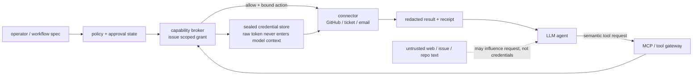
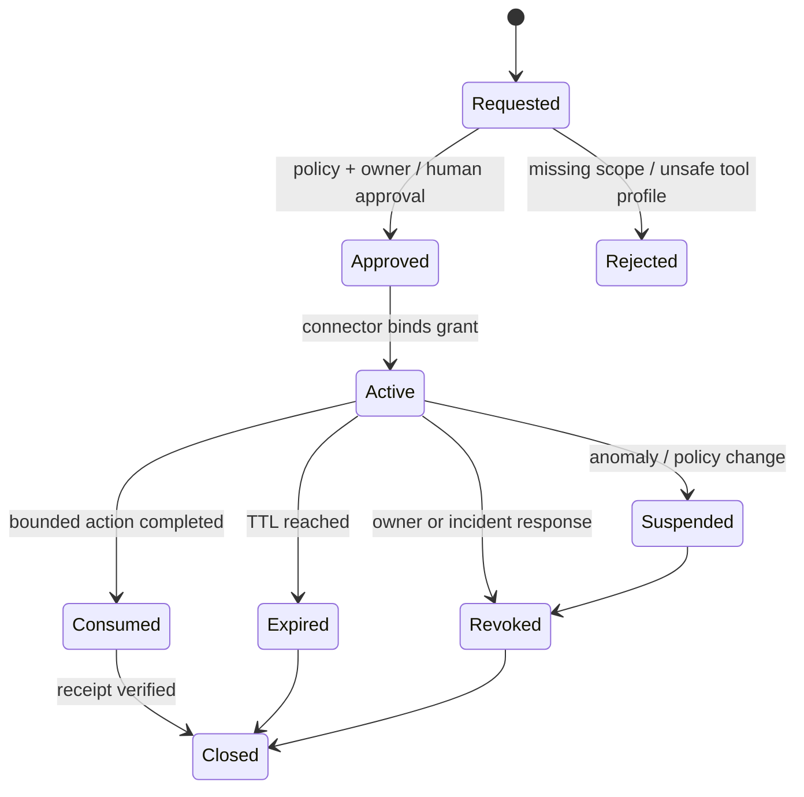
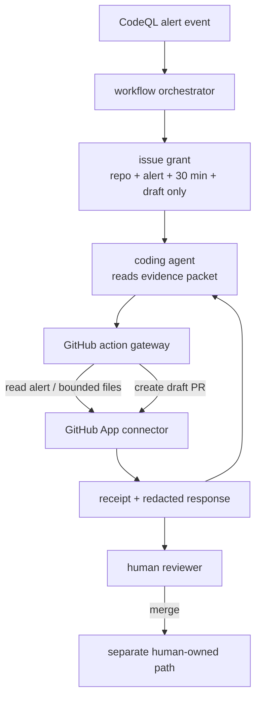

## 来源说明与站内差异

本文只讨论团队**自有或已明确授权**的 Agent 工作流中，如何约束 Agent 对 GitHub、工单、邮件、数据库等外部系统的权限。它不讨论获取第三方凭据、绕过认证或扫描外部目标。

主要依据如下：

- [ToolGuardian: Declarative Security for AI Agent-Tool Interactions](https://arxiv.org/abs/2607.21835)，2026-07-23 提交的预印本。它把安全拆为工具进入工作流前的 vetting 和单次调用时的 task-aware authorization；characterization 依次使用描述、系统调用轨迹、mock execution 与源码分析，把事实交给声明式策略层。作者在 16 个 MCP 风格工具、其中 8 个基于真实开源工具构造的恶意变体，以及 20 个运行时场景上评估；其 ASP 准入判定报告 deny-class F1 为 0.86，完整策略下的运行时场景为 20/20。上述数字均为作者报告，样本规模不足以构成生产安全保证。
- [GitHub Agentic Workflows 的 Security Architecture](https://github.github.io/gh-aw/introduction/architecture/)。文档将 agent API key 和 GitHub token 这样的外部认证 token 视为会约束组件外部效果的 *imported capabilities*，并用声明式配置控制 token 被载入哪些容器。这是一个很实用的工程模型，不是通用安全标准。
- [GitHub Agentic Workflows 的 Sandbox Configuration](https://github.github.com/gh-aw/reference/sandbox/)。当前文档说明 agent sandbox 默认使用 Agent Workflow Firewall，MCP 调用经统一 HTTP gateway；关闭 agent sandbox 需要操作者填写静态、可审阅的理由。它说明“删掉信任边界”应成为可见的发布决策。
- [Agent-Fence](https://arxiv.org/abs/2602.07652) 把 planning、memory、retrieval、tool use 与 delegation 之间的 14 类信任边界失败做成 trace-auditable breaks。作者报告 authorization confusion 与目标/工具劫持存在相关性；这里把它作为威胁建模信号，而不把论文中的风险数字外推到所有 Agent。
- [IETF Agent Security Evaluation Benchmark Internet-Draft](https://datatracker.ietf.org/doc/draft-han-bmwg-agent-security-benchmark/)（2026-07）把工具调用、工具链、人工接管、审计归因和执行隔离纳入评估维度。它明确仍是 work in progress，不能当作已经定稿的标准；本文只借用其“上线前后都需评测”的方法论。

站内已有文章讨论 Policy-as-Code reference monitor，强调让策略在动作执行前判定；也讨论过供应链安装门和安全修复 Agent。本文的范围更窄、更运行时化：**即使动作被允许，模型是否曾接触一个可被转发的长期 secret？谁真正持有外部 token？一次授权又如何结束、撤销并留下证据？** 下文的对象、接口、策略与指标都是我的工程设计。

## 先给结论

对高权限 Agent，最危险的默认配置不是“它有一个 GitHub 工具”，而是：`GITHUB_TOKEN`、云 API key 或数据库密码作为环境变量进入了模型可影响的进程，然后模型再决定该怎么使用它。

我会改成下面这个边界：

> **模型只能请求一个语义动作；只有 Capability Broker 能取得原始凭据，并把一次被批准的任务、资源、动作、时效和审批绑定到连接器执行。**

这不是给 Agent 再加一层 prompt，也不是把长效 token 包一层 Base64。它改变的是能力所在的位置：模型看到的是 `github.create_draft_pr` 这样的不透明操作面；Broker 和连接器才有解封短期凭据或使用服务身份的权力。



真正应被批准的对象不是“这个 Agent 可以访问 GitHub”，而是类似下面的细粒度事实：`run_42` 在 30 分钟内、仅针对 `org/repo` 的一个分支、只能读取告警和创建草稿 PR、不能合并、不能读取组织 secret、必须保留审计收据。

## 技术问题：工具 allowlist 不等于凭据隔离

把 token 放在 agent container 或 `env` 中看似方便：安装一个 CLI、写进配置、给模型一个执行 shell，它就能完成所有操作。但这让一个本应只服务于工具调用的凭据，变成模型上下文和任意子进程都可能触及的字符串。

即使模型没有专门的“读取环境变量”工具，风险也没有消失：一个被允许执行的脚本、一个具备网络出口的工具、一个错误配置的 MCP server，或一个由不可信文本影响的参数组合，都可能扩大 token 的作用范围。这里的核心不是断言“每次注入都会盗取 token”，而是承认一个基本事实：**只要模型控制的执行环境同时拥有可转发凭据和网络/写入能力，权限边界就比任务本身大。**

| 常见做法 | 看似解决的问题 | 仍然留下的边界错误 |
| --- | --- | --- |
| 给 Agent 一个全局 `GITHUB_TOKEN` | 可以调用 GitHub API | token 可用于任务外仓库、动作和时间窗口 |
| 只允许 `github` MCP server | 避免任意 HTTP | MCP server 仍可能拥有过宽 token 或被错误配置 |
| 在 system prompt 写“不要泄露 secret” | 提醒模型 | 提醒不是凭据保管与传输控制 |
| 工具调用前做 allow/deny | 限制某次 action | 不解决 raw token 已被进程/插件读取 |
| 每个 Agent 一把 service key | 简化身份识别 | 多任务共享同一 blast radius，难以撤销和归因 |

ToolGuardian 的两阶段视角很关键。工具准入解决“这个工具的声明、观察到的效果和潜在行为是否适合进入工作流”；任务内授权解决“即使工具可信，这次调用是否适合当前任务”。Capability Broker 再补一个经常缺失的问题：**这次调用不需要让模型拥有长期 credential 本身。**

## 机制拆解：从 imported capability 到可核销授权

### 1. 准入：先确认工具的能力事实，而不是相信描述

MCP tool description 是给模型选工具的界面，不应天然成为安全规格。ToolGuardian 的 progressive characterization 很值得借鉴：低成本的描述只提供声明意图；系统调用轨迹、mock execution 和源码分析再逐层增加关于文件、网络、子进程、状态写入与声明-实现不一致的事实。

我的落地方式会把每个 connector 登记成一张不可随 prompt 改写的能力卡：

```ts
type ToolProfile = {
  toolId: string;
  versionDigest: string;
  declaredActions: string[];
  observedEffects: Array<"network" | "filesystem" | "process" | "remote_write">;
  credentialModes: Array<"service_identity" | "delegated_oauth" | "short_lived_token">;
  allowedDestinations: string[];
  sourceReview: "reviewed" | "restricted" | "rejected";
  lastVerifiedAt: string;
};
```

这张卡的目的不是给每个工具打一个“安全/不安全”分数。一个能写 GitHub PR 的 connector 必然有 `remote_write`，它在草稿 PR 工作流里合理，在读取公开 issue 的研究任务里却不合理。准入层只回答“它客观能做什么、它的身份如何取得、谁维护它”；是否允许该能力要留给后续的任务授权。

### 2. 签发：授权绑定任务，不绑定 Agent 人格

Agent identity 适合记录“哪个运行实例提出请求”，不该单独决定它长时间能做什么。真正的 grant 应由可信编排器根据触发事件、仓库、owner、任务类型和审批状态签发：

```ts
type CapabilityGrant = {
  id: string;
  issuer: string;
  subject: { agentRunId: string; workflowId: string };
  connector: { toolId: string; versionDigest: string };
  resource: { provider: "github" | "jira" | "email"; scopes: string[] };
  actions: Array<"read_alert" | "read_file" | "create_draft_pr" | "comment">;
  constraints: {
    branch?: string;
    maxWrites?: number;
    requireDraft?: boolean;
    approvalRef?: string;
    egressClass?: "provider_only" | "none";
  };
  issuedAt: string;
  expiresAt: string;
  policyVersion: string;
  state: "active" | "suspended" | "revoked" | "expired";
};
```

这里刻意没有 `secret: string`。Grant 是能力声明，不是 bearer token 的副本。Broker 可以把 grant 映射到 provider 的短期 OAuth token、GitHub App installation token，或保存在连接器侧的服务身份；无论具体实现怎样，原始 credential 都不应作为 agent 可读工具结果、环境变量或日志字段出现。



`maxWrites`、`requireDraft` 和 `approvalRef` 让权限具备业务语义。比起给一个 “repo:write”，它能表达“可以创建一次草稿 PR，但不能 merge、不能把分支推到别的仓库、不能用这次授权再发评论给外部组织”。

### 3. 调用：Agent 请求动作，Gateway 持有判定权

模型侧发出的永远是结构化意图，而不是 header、cookie、token 或任意 URL：

```json
{
  "grant_id": "grant_01J...",
  "action": "create_draft_pr",
  "resource": "github:acme/payments",
  "input": {
    "base": "main",
    "head": "agent/fix-cve-1234",
    "title": "Draft: update parser dependency",
    "body_ref": "artifact://reviewed-pr-description/42"
  }
}
```

Gateway 需要独立验证五件事：grant 尚有效、request 来自被绑定的 `agentRunId`、connector profile 未变、action/resource/参数满足约束、运行时 policy 没有新增撤销条件。验证通过后由 connector 以其保管的凭据调用 provider；返回给 Agent 的内容默认经过字段级脱敏和长度限制。

```ts
async function invoke(request: ToolRequest, caller: AgentIdentity) {
  const grant = await grants.load(request.grant_id);
  assertBoundToRun(grant, caller.runId);
  assertActive(grant);
  assertToolDigest(grant.connector);
  policy.authorize(grant, request);

  const credential = await credentialBroker.resolveForConnector(grant);
  const result = await connector.invoke(request, credential);
  return receipt.redactedResult(result, grant);
}
```

这段伪代码的安全点在顺序上：Agent 永远没有 `credential` 变量，connector 也不能拿 grant 做超出声明范围的任意请求。实现中要避免一个常见退化：Gateway 最终调用了一个“可传任意 method/path/body”的万能 HTTP MCP 工具。那只是把万能 token 换了一个入口；应把高风险 provider 动作建成固定、可验证的语义 action。

### 4. 收尾：撤销优先于清理，收据优先于“看起来成功”

安全事件、仓库所有权变更、用户撤回授权、工具版本漂移，都要求立即停止 grant 的后续效果。`revoked` 应在 Gateway 的读路径即时生效；缓存、排队重试和已生成的 tool plan 再异步清理。否则一个“已批准但尚未发送”的动作会在撤销后被队列重放。

我会为每次调用写一份不含 secret 的 receipt：

```ts
type CapabilityReceipt = {
  grantId: string;
  invocationId: string;
  toolDigest: string;
  resourceDigest: string;
  action: string;
  decision: "allowed" | "denied" | "revoked" | "expired";
  policyVersion: string;
  approvalRef?: string;
  resultRef?: string;
  occurredAt: string;
};
```

它支撑两个很具体的回溯问题：某一次外部写入到底由哪个 workflow 和哪项批准触发？工具或策略改变后，哪些历史调用可能受影响？日志应保存 digest、opaque reference 和决策理由，不能为了可审计重新存一份 API token、完整用户输入或敏感 provider response。

## 工程方案：一个只做三种动作的 Broker

第一版不应取代组织的 IAM，也不应支持任意 provider。选一个团队反复用到的场景，例如“接收 CodeQL 告警后开草稿修复 PR”，只支持三种 GitHub 动作：读取指定 alert、读取限定目录的文件、创建草稿 PR。



关键分工如下：

| 角色 | 可以做什么 | 明确不能做什么 |
| --- | --- | --- |
| 编排器 | 根据事件签发有限 grant、触发撤销 | 保存 provider 长期 secret、替 Agent 猜权限 |
| Agent | 提出结构化读取/草稿动作、解释结果 | 读取 token、任意 HTTP、合并/发布 |
| Gateway | 验证 grant、参数和实时 policy | 代替人批准业务风险 |
| Connector | 用保管身份调用限定 provider API | 接受任意 path/method，返回原始 secret |
| 人类 reviewer | 审核 patch、接受风险、合并 | 把一次审核变成永久授权 |

一个最小策略可以读作：

```yaml
capability_policy:
  - when:
      workflow: codeql-remediation
      action: create_draft_pr
    require:
      grant_ttl_minutes_max: 30
      connector_profile: github-app-reviewed
      branch_prefix: agent/
      draft: true
      max_writes: 1
      human_merge: separate_principal
    deny:
      - direct_secret_to_agent
      - arbitrary_http_request
      - repository_outside_grant
      - organization_secret_read
  - when:
      tool_profile_changed: true
    effect: suspend_active_grants
```

GitHub Agentic Workflows 文档使用 imported capability 与容器分配这一思路，正适合作为实现参照：把 token 当作可导入、可限制、可审阅的外部效果来源，而不是 Agent 的常驻人格属性。本文不要求照搬它的具体 firewall；在任何 agent harness 中，只要能把 “模型进程” 与 “有凭据的连接器” 变成两个不同边界，就可以先落地这个最小版本。

## 可复制 SOP：一周试点

1. **盘点现在的 secret 路径。** 列出所有 Agent container 的环境变量、挂载文件、CLI credential store、MCP config 和日志字段。目标不是先修，而是确认哪些 raw token 真正进入过模型可影响的进程。
2. **缩小一个业务动作族。** 选只读研究、工单草稿或草稿 PR 之一；写清 provider、资源、动作、最大次数、TTL、人工关口和撤销人。
3. **登记 ToolProfile。** 固定 connector 版本 digest，记录副作用、凭据模式、目的地和源码审查状态。connector 更新先挂起旧 grant，复核后再恢复。
4. **实现 opaque grant。** Agent runtime 只拿 `grant_id`；raw token 仅由 connector 或受控 token exchange 使用。禁止在 tool result、tracing 和 error message 中回显敏感 header。
5. **接 Gateway contract test。** 对错 runId、错 repo、错 action、过期 grant、已撤销 grant、重复写入、tool digest 改变逐一断言拒绝；对授权动作断言 receipt 完整。
6. **做隔离的注入回放。** 使用合成的、不含真实 secret 的不可信 issue/网页/仓库文本，验证模型即使被引导请求任务外动作，Gateway 仍拒绝，且模型无法读取 credential。不要在生产工作流里投放真实攻击载荷。
7. **小流量运行并复盘。** 首周只允许草稿或只读；检查 deny 是否可解释、false deny 是否可修复、是否出现任何 direct-secret access，并由 security owner 决定扩大还是回滚。

## 可验证指标与成本账本

| 指标 | 定义 | 判断方式 |
| --- | --- | --- |
| Secret exposure paths | raw credential 可从 agent process、日志、tool result 读取的路径数 | 目标为 0，按部署清单与运行探针复核 |
| Grant coverage | 高风险 provider 调用中由有效 grant 驱动的比例 | 目标为 100%，无 grant 调用 fail closed |
| Scope-escape block rate | 错 repo/action/参数/目的请求被 Gateway 拒绝的比例 | 合成回放必须为 100% |
| Revocation convergence p95 | 撤销到 Gateway、队列、缓存都拒绝的时间 | 设定业务 SLA，超时告警 |
| Receipt completeness | 外部效果具备 grant、policy、tool digest、资源 digest 的比例 | 目标为 100% |
| Authorized task completion | 合法任务在不扩大权限下成功完成的比例 | 防止“安全设计”把流程做死 |
| False-deny review rate | 被人确认本应允许的拒绝比例 | 用来改进 action/constraint 模型 |
| Broker overhead | grant 签发、授权判定和 token exchange 的 p50/p95 | 与直连基线比较，不用猜测成本 |

成本通常不是 token exchange 本身，而是 connector 适配、资源模型、审计存储和例外流程。可以先用“一个 provider、三种 action、一个工作流”证明这套边界没有显著拖慢授权任务，再逐步加 Jira、邮件和数据库。不要反过来先造一套抽象 IAM 平台，那样很容易只得到一座没有业务验证的权限博物馆。

## 失败模式与回滚

| 失败模式 | 根因 | 处置 |
| --- | --- | --- |
| Broker 成了万能 HTTP 代理 | action 没有语义约束 | 关闭任意 path/method，拆成固定 provider action |
| Agent 仍能从环境读到 token | 旧 CLI/config/mount 未清除 | 审计进程环境与挂载，迁移到 connector-side identity |
| grant 可以无限重放 | 没有 invocation nonce 或写入计数 | 使用单次 nonce、`maxWrites` 与幂等键 |
| 撤销后队列仍执行 | worker 只在入队时验权 | 在真正出站前再次验 grant state |
| 工具更新扩大副作用 | profile 与部署版本脱钩 | profile digest 变更即 suspend，重做 vetting |
| 策略过窄导致团队旁路 | action/资源模型没有覆盖合理例外 | 用 receipt 与 false deny 复盘，增加显式例外，不给全局 token |
| 审计数据泄漏 | 日志记录 header、完整 payload | token/PII 脱敏，最小化 resultRef，设保留期 |

回滚不应是把所有 Agent 改回环境变量直连。正确的降级方式是：暂停高风险 grant 签发、保留只读动作、把写入操作转人工或受控服务账号，并保留 receipts 以定位受影响调用。若 Broker 本身故障，默认拒绝外部写入；对明确业务连续性要求的只读动作，可以设计独立、低权限、短期的应急路径，但也应有审计与到期时间。

## 局限分析

Capability Broker 不能让已经进入模型上下文的敏感信息自动消失，也不能修复一个拥有过宽权限的 provider 身份。它减少的是**未来每一次调用中模型直接接触并转发 raw credential 的机会**，同时把外部效果缩小到可检查的任务粒度。

ToolGuardian 是预印本，16 个工具和 20 个场景不能代表真实企业中数百个 MCP server 的生态；其 ASP 结果说明声明式事实/策略值得研究，不证明 ASP 是唯一实现。GitHub Agentic Workflows 是特定项目的文档，具体字段、firewall 和默认行为会演进。IETF 文档仍是草案，不应拿来声称合规。

最后，权限缩小会增加一些摩擦：需要更好的任务建模、connector 适配、审计和例外审批。这个成本在只读、低风险聊天场景未必值得；在能改代码、发外部消息、读客户数据或写业务系统的 Agent 里，反而是让自动化可以长期被信任的必要成本。

## 自审

- **事实可靠性：** ToolGuardian 的方法和结果明确标为作者报告；GitHub Agentic Workflows 的 imported capability、sandbox 和 gateway 只按官方文档描述；IETF 草案明确标注为未定稿。
- **工程价值：** 给出 ToolProfile、CapabilityGrant、Receipt、状态机、Gateway 伪代码、策略、职责表、试点 SOP、指标和回滚方式，而非仅建议“最小权限”。
- **站内差异：** 相比通用 Policy-as-Code 文章，本文的核心是 raw credential 不进入模型上下文、connector 持有凭据、task-bound grant 的签发和核销；相比安全修复文章，重点是外部权限边界，不是 PR 处置运营。
- **薄内容与标题：** 包含两张流程图、状态机、数据模型、配置、验证和局限；标题只承诺一种可实现的安全设计，没有宣称彻底消除提示注入。
- **安全边界：** 所有例子限制在授权工作流与防御控制，不含第三方访问、token 获取或规避认证的操作步骤。
