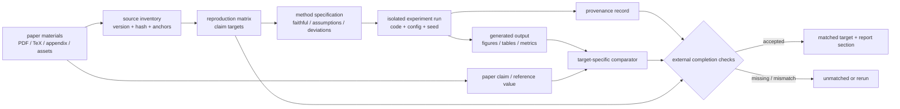
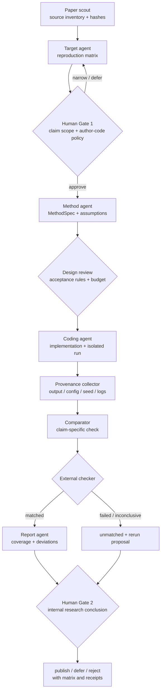

## 来源说明与站内差异

本文讨论的是有代码、数据、图表或数值结果的**计算型论文复现**，不是让 Agent 摘要论文、写 literature review，也不是替代领域同行评审。

主要依据如下：

- Hans 与 Bilionis 的 [Coding-agents can replicate scientific machine learning papers](https://arxiv.org/abs/2607.02134)，2026-07 的预印本。论文提出 Paper-replication：把每个待复现的计算 claim 记录成 target，要求 target 同时具备方法重建、执行记录、provenance、与原论文主张的比较证据、报告覆盖和外部 validation check 才能标记为 matched。作者在四篇科学机器学习论文、12 次独立运行中报告 158 个 recorded target 都具备报告覆盖并通过其 completion gate；作者也明确报告了多次运行间目标拆分、数值保真、耗时和验收规则的差异。所有效果数字均是作者在特定论文/环境/完成定义下的结果，不代表任意论文都可被自动复现。
- [Paper-replication release bundle](https://github.com/PredictiveScienceLab/paper-replication-paper)。仓库公开了 Codex 与 Claude Code 的 skill、12 个 agent 生成的 case-study workspace，以及分析脚本；README 明确把 case studies 当只读分析证据。它为本文的“工作区记录与结论分开保存”提供可检查的实现参照。
- [GitHub Agentic Workflows 官方文档](https://docs.github.com/en/enterprise-cloud@latest/copilot/concepts/agents/about-github-agentic-workflows)。文档把自然语言指令、YAML 权限/trigger/safe output 和编译后的 lock workflow 分开，并强调人审、只读默认、受声明限制的写入、隔离 secrets 与运行成本上限。它不是科研复现工具，但说明 AI Native 工作流应将文字指令与可执行边界分离。

站内 7 月 1 日文章讨论“研究问题如何变成可执行 workflow”，7 月 20 日文章讨论“研究 run 如何编译为 Evidence DAG 与发布状态”。本文进一步收窄到一个更容易被误判的场景：**Agent 从论文材料重建计算方法时，什么才算某个具体结果真的被复现？** 本文的目录、接口、验收规则、权限和指标是我的工程建议，不是上述论文或项目的标准承诺。

## 先给结论

“复现了这篇论文”不是一个可以由 Agent 在最终消息里宣布的布尔值。它至少包含一组可分别失败的 claim：某张图的趋势、一个表格的数值、一个误差阈值、一个置信区间的覆盖率、一个消融结论，甚至一个算法结构。

我会把 AI Native 复现的最小单位定义为：

> **一个 target = 一个可定位的论文 claim + 一份明确的方法重建 + 一次可追溯运行 + 一条 claim-specific 比较规则 + 一处报告覆盖。**

只有 target 的证据包经独立 checker 接受，才允许它被写成“matched”。一个生成的图、一次测试通过，或 Agent 自己的解释都不够。



这不是故意把复现做慢。相反，它避免团队在三天后才发现“那张看起来很像的图来自 paper asset、替代方法，或一组没有记录 seed 的临时运行”。

## 场景定义：复现一篇论文中的三个核心结果

选择一个足够小、但有真实工程价值的场景：平台研究团队评估一篇新的 Agent memory 或安全分析论文，想在自有隔离环境中确认三个主张是否值得纳入技术路线。

例如，输入可以是论文 PDF/TeX、补充材料、公开数据或可生成的合成数据、允许的计算预算和“是否允许用作者代码”的规则；输出是一个内部复现报告，分别回答：

1. 论文最关键的三个结果具体是什么；
2. 哪些已在本地按论文方法得到支持，哪些只是接近、失败或因材料缺失而未验证；
3. 哪些实现选择是论文未写清而由团队假设的；
4. 是否足以进入下一阶段试点，而不是“论文看起来有道理”。

传统流程通常是一个研究员读 PDF，Agent 帮忙解释，随后有人在 notebook 中跑几次。最终文档可能只有“基本复现，指标接近”。这种说法无法回答“接近哪个 claim、差多少、是否复用了作者图、方法有没有替换、为什么没复现另一个表”。

| 原流程 | 看似产物 | 实际缺口 | AI Native 目标状态 |
| --- | --- | --- | --- |
| 读论文 | 一份摘要 | 数值/图表/结构主张未拆开 | `ClaimTarget` |
| 写 notebook | 一段能跑的代码 | 代码是否忠实重建方法不清 | `MethodSpec` |
| 执行 | stdout 和图片 | 输入、版本、seed、环境不可追溯 | `RunRecord` |
| 看结果 | “差不多” | 没有针对 claim 的可判定标准 | `ComparisonEvidence` |
| 写报告 | 一段结论 | 已匹配与未匹配内容混在一起 | `ReportCoverage` |

目标不是要求每篇论文达到 bit-for-bit 一致。现实中论文常遗漏初始化、预处理、硬件、容差或绘图细节。目标是把不确定性记录成假设，并让“未能验证”成为合法结果，而不是被 Agent 的流畅叙述覆盖。

## 原流程痛点：相似输出不能证明方法复现

Paper-replication 直接指出几个 prompt-only 失败模式：Agent 可能只做完论文的一部分就停止；把自己的进度描述当成证据；拿论文提供的 figure/asset 计为生成结果；为了得到类似输出而替换了论文方法。这不是科学机器学习独有的问题，任何含计算主张的系统论文、benchmark 报告或安全评测都可能踩中。

我们需要区分四种看起来都很像“成功”的状态：

| 状态 | 已知事实 | 不能推导出的结论 |
| --- | --- | --- |
| `output_exists` | 生成了图/表/数值文件 | 它来自正确方法或输入 |
| `run_passed` | 进程退出码为 0 | 运行回答了论文 claim |
| `looks_similar` | 输出与原图趋势类似 | 没有复用资产、没替代方法 |
| `matched` | 目标级证据经规则接受 | 该论文所有结论已被证明正确 |

最后一行也必须克制：`matched` 仅表示“在预先记录的 target 与 acceptance rule 下，这次工作区有可检查证据”。它不是独立同行评审，更不是该方法在所有数据、硬件和场景下都有效的证明。

## 机制拆解：把论文变成有限、可检查的 target set

### 1. ClaimTarget 不等于论文段落

一个 target 可以是标量、表格单元、图形结构、分布性质或算法行为。它需要锚定原文，并明确需要重建的最小方法/数据部分：

```ts
type ClaimTarget = {
  id: string;
  title: string;
  kind: "scalar" | "table_cell" | "curve" | "distribution" | "structure" | "algorithm_behavior";
  paperAnchor: {
    source: string;
    pages?: number[];
    figureOrTable?: string;
    quoteOrCaption: string;
  };
  expected: {
    value?: number | string;
    unit?: string;
    qualitativeProperty?: string;
  };
  methodRefs: string[];
  dataRefs: string[];
  acceptanceRuleId: string;
  status: "planned" | "active" | "blocked" | "matched" | "unmatched" | "out_of_scope";
  reportSection: string;
};
```

`status` 必须允许 `blocked` 与 `unmatched`。若数据不可得、方法细节缺失或预算不足，正确行为是把原因写清，而不是把 target 从矩阵中悄悄删掉。论文的工作区还使用一个 task ledger 保持单一 active target，这个细节很朴素，却能避免长任务中的 Agent 因为上下文滚动而遗失尚未处理的 claim。

### 2. MethodSpec 记录“我如何理解论文”，而不是藏在代码里

一份复现代码即使能跑，也未必实现了作者的方法。要把方法重建独立成可审查文件：公式/算法对应哪个 anchor、预处理是什么、缺失参数如何假设、哪些偏差是主动选择的。

```yaml
target: fig2-error-decay
method_spec:
  paper_anchors:
    - section: "3.2"
      equation: "Eq. 7"
    - appendix: "A.3"
  reconstruction:
    optimizer: "Adam"
    learning_rate: 0.001
    schedule: "not stated; held constant as an explicit assumption"
    preprocessing: "normalize each input feature using training split statistics"
  deviations:
    - "GPU model differs from paper; deterministic kernels enabled where available"
  prohibited_substitutions:
    - "do not use paper-provided figure files as generated output"
    - "do not replace stated loss with a proxy objective"
```

这里的关键不是逼迫论文作者补全所有细节，而是把团队自己的补全选择变得可见。若一个未声明的 scheduler 恰好让结果变好，报告应写“在假设 A 下的近似重现”，不能写成“复现了作者结果”。

### 3. Evidence bundle 连接输出、运行、比较与报告

对 target `t`，我会要求如下 evidence bundle：

```ts
type TargetEvidence = {
  targetId: string;
  generatedOutput: { uri: string; digest: string; kind: "figure" | "table" | "metric" };
  run: {
    commit: string;
    containerDigest: string;
    configDigest: string;
    dataDigest: string;
    seed?: number;
    commandRef: string;
    logRef: string;
  };
  methodProvenance: Array<{ methodRef: string; paperAnchor: string; implementedAt: string }>;
  comparison: { ruleId: string; result: "pass" | "fail" | "inconclusive"; evidenceRef: string };
  reportCoverage: { section: string; renderedReportDigest: string };
};
```

Paper-replication 的论文将这类 bundle 表示为生成结果、run record、provenance、comparison evidence 和 report coverage 的组合。这个形状值得借用，因为它切断了一个常见偷懒路径：只要少了 method provenance 或 comparison evidence，生成的 output 就不能单独计作 matched。

### 4. 每类 claim 有自己的 acceptance rule

一条数值和一张趋势图不该共用“相似度大于 0.9”之类的万能阈值。验收规则必须在运行前被记录，并允许显示 `inconclusive`：

| Claim 类型 | 可以接受的规则例子 | 不足的规则 |
| --- | --- | --- |
| 标量指标 | 绝对/相对误差在预设容差内，单位与数据切分一致 | 只比较打印小数位 |
| 表格 | 指定单元格、统计口径、重复次数均吻合 | 表格总趋势相似 |
| 曲线 | 指定区间的单调性、排序、面积或置信带关系 | 截图视觉上像 |
| 分布 | 覆盖率、分位数、检验结果或预设距离度量 | 均值接近 |
| 算法结构 | 跟踪方法步骤/约束是否存在，外加行为测试 | 结果碰巧相似 |

论文也强调，数值、分布、结构和视觉 claim 的证据应当 claim-specific，而不是强求精确数值相等。工程上我会再加一条：**acceptance rule 的变更必须产生新版本 target**。不能看到结果不佳后悄悄放宽规则，再把同一次运行标成成功。

## 目标工作流：Agent 做重建与记录，Checker 决定完成



### Agent、工具与人的边界

| 角色 | 输入 | 输出 | 不该拥有的权力 |
| --- | --- | --- | --- |
| Paper Scout | 论文、附录、TeX、数据链接 | source inventory、hash、anchor | 修改论文 asset、宣布 claim 完成 |
| Target Agent | inventory、渲染页 | reproduction matrix | 删除不利 target、改写原论文结果 |
| Method Agent | target、paper anchor | MethodSpec、假设、偏差 | 把假设静默写进实现 |
| Coding Agent | 已批准的 spec、限制环境 | 代码、config、run request | 把 paper assets 当生成物、变更验收规则 |
| Comparator | target、生成结果、原论文参考 | pass/fail/inconclusive evidence | 读取 Agent 自评并替代规则 |
| Human reviewer | matrix、偏差、comparison、成本 | 范围确认、研究结论、后续决策 | 把 review 当作永久自动授权 |

有些控制可用 GitHub Agentic Workflows 这类工具的思想实现：自然语言 body 只能表达任务，frontmatter/编译产物明确触发、权限、safe output 和预算。对论文复现，第一版可以只开放写入一个新分支下的 `replication/` 目录，禁止改变原始资料、外发数据、创建昂贵云资源或发布正式结论；需要大算力时，由人明确批准一个 digest 固定的 run plan。

## 数据、代码与权限边界

复现经常被误当作“开放论文，所以所有东西都能自动下载、运行和上传”。现实里可能包含数据许可、作者代码许可、模型 API、GPU 配额和企业资料。

```yaml
replication-policy:
  source_material:
    immutable_roots: ["paper/", "paper-assets/"]
    author_code: "forbidden" # this study's policy; do not infer it from the paper
  data:
    allowlisted_sources: ["zenodo.org", "huggingface.co/datasets"]
    restricted_data: "metadata_only"
    external_upload: "blocked"
  execution:
    network: "allowlisted-downloads"
    workspace_write: ["replication/"]
    max_gpu_hours: 8
    max_wall_clock_minutes: 240
    require_approval_for: ["paid_api", "full_dataset", "new_container_image"]
  publication:
    agent_may_write: ["internal-report-draft"]
    agent_may_not_write: ["authoritative-knowledge-base", "external-post"]
```

重点不是复制这份 YAML，而是让以下事实可查询：本次是否允许作者代码？数据来自哪、是否可再分发？运行是否读到组织 secret？谁批准了额外算力？报告是否只是内部草稿？没有这些边界，复现工作流很容易从“验证论文”漂移到“不受控地跑第三方软件和数据”。

## 可复制 SOP：一周做一个三 target 复现实验

1. **选一篇可控论文。** 只选有明确计算 claim、材料可获取、规模可在预算内运行的论文。先声明是否允许作者代码；若不允许，不能在中途为了赶进度改口。
2. **冻结材料。** 建立 `paper/`、`paper-assets/`、`replication/` 三个根目录，记录 URL、版本、下载时间、license 与 SHA-256。原始材料只读，生成物不允许写回这些目录。
3. **建 reproduction matrix。** 先选 3 个代表性 target：一个数值、一个图/趋势、一个结构或消融。每个都有 paper anchor、数据/方法依赖、验收规则和报告位置。
4. **人工 Gate 1。** 研究负责人确认 target 真的代表主张、验收不因结果而临时放宽，并确认预算/数据权限。
5. **写 MethodSpec。** Agent 根据论文/附录重建；未写清之处以 assumption 标记。人审只审关键假设，不逐行审代码。
6. **先 dry run。** 用合成或小切片数据验证 pipeline、日志、seed、output path 与 checker。dry run 通过不等于 target matched。
7. **运行并收集证据。** 每次 run 固定 commit、config、环境、数据 digest、命令和日志；输出单独落在 `replication/artifacts/`。
8. **独立 compare。** comparator 只接收 target、参考值/属性和生成结果；它的 pass/fail/inconclusive 输出必须携带 rule id 和原始统计/图形证据。
9. **报告覆盖检查。** 所有 `matched` target 在报告中出现，所有 `unmatched`/deviation 也出现。checker 发现遗漏时，禁止把工作区标为完成。
10. **人工 Gate 2。** 做出 “值得试点 / 证据不足 / 反例或失败” 的内部决策。不要把“所有任务都有文件”误写成“论文正确”。

建议目录如下：

```text
replications/<paper-slug>/
  paper/                 # immutable source snapshot
  paper-assets/          # immutable figures/tables, separately hashed
  inventory/
    sources.json
    rendered-pages/
  matrix/
    targets.yaml
    active-target.yaml
  specs/
    method/
    acceptance-rules/
  replication/
    src/
    configs/
    artifacts/
    runs/
  evidence/
    comparisons/
    provenance/
    receipts/
  report/
    replication-report.md
    replication-report.pdf
```

## 我会如何验证：以“不允许假成功”为第一验收

第一周不追求论文级完成率。目标是让三种错误都被系统发现：

| 验证用例 | 预期结果 | 证明什么 |
| --- | --- | --- |
| 将 paper 原图复制到 generated 目录 | checker 拒绝或标记异常 | asset 与生成物的隔离有效 |
| 替换论文指定 loss/算法 | MethodSpec/provenance gate 阻止标 matched | 相似输出不够 |
| 故意使用错误 seed/数据切分 | comparator 为 fail 或 inconclusive | claim rule 确实约束比较 |
| 删除 run log 或 config digest | completion gate 失败 | provenance 不能靠 prose 补写 |
| 让一项 target 未进入报告 | report coverage check 失败 | 未复现内容不会被悄悄隐去 |
| 合法小样本重跑 | 产生可比 receipt，且不额外获取权限 | 工作流不只会阻断 |

这里应该关注的指标不是“Agent 用了多少步”，而是证据是否完整、失败是否显性、人工是否更快判断：

| 指标 | 定义 | 解释 |
| --- | --- | --- |
| Target coverage | 有定义 target / 计划内 target | 防止只挑最容易的结果 |
| Evidence completeness | matched target 中 evidence bundle 完整比例 | 不完整即不应叫 matched |
| Method fidelity coverage | 有 paper anchor 或显式 assumption 的实现组件比例 | 发现静默替代 |
| Claim acceptance rate | pass target / completed target | 不能脱离 unmatched 原因解读 |
| Inconclusive rate | 规则无法判断的 target 比例 | 指示 rule 或材料需要改进 |
| Report parity | matrix 状态与报告状态一致的比例 | 防止叙述漂移 |
| Correction work | 从首次 run 到 accepted evidence 的重跑/修正次数 | 衡量 harness 是否在减少返工 |
| Reviewer decision time | reviewer 从打开 evidence 到给出决策的时间 | 衡量实际工作价值 |
| Cost per accepted target | 计算、模型、人工时间 / accepted target | 允许比较不同任务形态 |

Paper-replication 作者发现同一论文的不同独立运行，在 target 拆分、数值保真、耗时和验收判断上仍会变化。我的工程推断是：团队不应把一次 completed workspace 当作最终真相，而要保留 target matrix 与 acceptance rule 的版本，必要时请第二位研究员或独立 Agent 重跑关键 target。

## 失败模式与回滚

| 失败模式 | 为什么危险 | 处理方式 |
| --- | --- | --- |
| Agent 只处理容易 claim | 报告看似完整，主结论没被触及 | Gate 1 对照摘要/图表审 target coverage |
| paper asset 混入生成目录 | 可造成视觉上的假复现 | 只读分根、hash 比对、禁止 asset path 作输出 |
| 替代方法结果更好 | 技术上有趣，但不能计作原方法复现 | 标为 deviation/side experiment，不能标 matched |
| 论文细节缺失 | Agent 会默默补全并过度自信 | 把缺失写为 assumption，必要时 `blocked` |
| 比较规则后改 | 结果导向地放宽门槛 | rule 版本化；变更创建新 target revision |
| 计算预算耗尽 | 未完成被误解为负结论 | 保持 `blocked_by_budget`，保留已收集 evidence |
| Agent 连续重试 | 成本上升且污染可比性 | 设每 target rerun budget，超限转人工 |
| 报告只写成功项 | 研究结论偏置 | report parity 是 completion gate 的一部分 |

回滚指的是撤回**状态**，不是删掉失败运行。若发现某个 acceptance rule 或 parser 有 bug，应将受影响的 `matched` 标为 `recheck_required`，保留原 receipt 和工具版本，再在新规则版本下重新判定。失败运行、假设和比较结果都应保留为受控证据；删掉它们会让团队无法知道之前为什么得出了错误结论。

## 局限分析

Paper-replication 的范围是计算型科学机器学习论文，前提是材料、数据和计算环境足以重建结果；它不等价于湿实验复现、临床研究再现、系统安全评估或理论证明。论文中“12 次运行、158 个 target 都通过 completion gate”说明该 workflow 在给定语料与定义下可行，不能说明它优于所有无结构工作流，也不能证明得到的 target 在科学上唯一正确。

此外，hash 隔离可以抓住直接复制，却不能排除所有变换后的资产复用；provenance 能显示 Agent 如何实现，不能保证论文未写出的细节只有一种合理解释；一个良好的 comparator 也依赖人事先定义正确的 claim 与容差。因此人类最值得投入的地方不是逐行盯 Agent，而是确认 target scope、关键假设、验收规则和最终解释。

最后，这套流程不适合每一次阅读。对于了解领域背景的低风险阅读笔记，复现矩阵可能成本过高。它适用于会影响技术选型、研发投入、模型上线或对外结论的关键论文；越高影响，越不该让“Agent 说它复现了”成为唯一证据。

## 自审

- **事实可靠性：** Paper-replication 的目标级机制、完成条件、四篇论文/12 次运行/158 target 和运行差异均明确标为作者报告；开源 bundle 的 skill、case study、analysis 目录来自仓库 README；GitHub 工作流能力仅按官方文档描述。
- **不是摘要复述：** 文章把论文方法落为 ClaimTarget、MethodSpec、TargetEvidence、state gate、权限策略、目录、SOP、负向测试、指标与回滚，明确回答如何把它用于团队决策。
- **站内差异：** 不重复通用研究规格或证据 DAG，聚焦论文计算主张的 target-level 复现与“相似输出不能结案”的反假成功机制。
- **质量与边界：** 包含两张流程图、三个代码/配置合同、多个失败用例和人工 Gate；不把 completed workspace 写成论文正确性证明，也不鼓励未经许可下载/运行第三方软件或数据。
