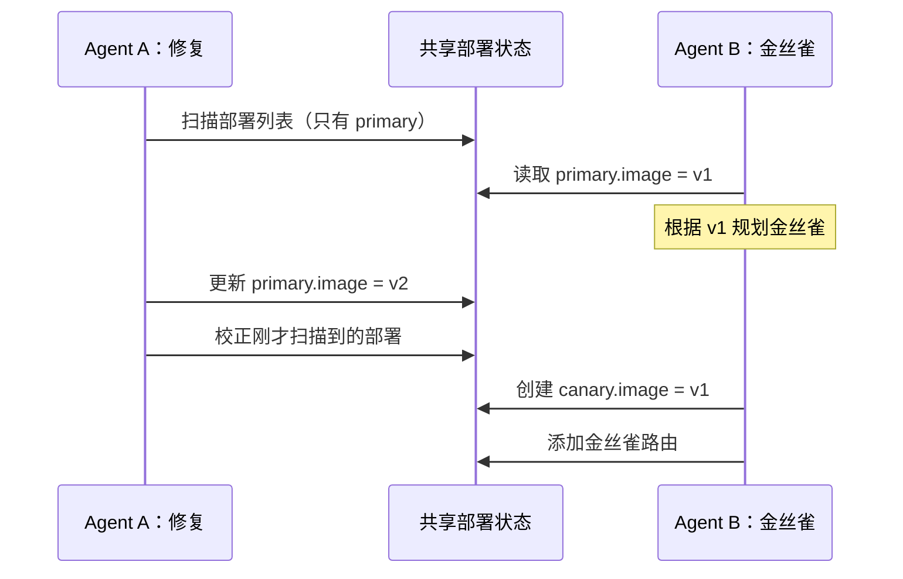
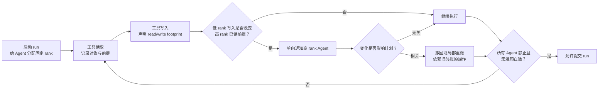

两个 Agent 同时操作一个系统时，最危险的结果不一定是报错。更麻烦的情况是：每个工具调用都返回成功，每个 Agent 也完成了自己的任务，但系统最后停在一个**不可能由任何正常先后顺序产生**的状态。

本文用一个贯穿全文的例子解释这个问题。Agent A 要把主部署从镜像 `v1` 修复到 `v2`，并把扫描到的其他部署一并校正；Agent B 要读取主部署当前使用的镜像，据此创建一套金丝雀部署并接入路由。两项任务单独执行都没有问题，并行后却可能得到：

```text
primary = v2
canary  = v1
route   = ready
```

读完本文，你应该能做三件事：判断一次多 Agent 失败是不是并发异常；为共享文档或知识状态加上最小版本保护；知道什么时候简单的 `409 Conflict` 已经够用，什么时候才值得引入 CoAgent 式的通知与局部修复。

## 先看清问题：这个结果为什么“不可能”

先把两个 Agent 串行执行。无论谁先开始，金丝雀最终都应该使用 `v2`。

| 执行顺序 | Agent A 看到什么 | Agent B 看到什么 | 最终状态 |
| --- | --- | --- | --- |
| A 再 B | A 把主部署修到 `v2` | B 读取 `v2` 并创建金丝雀 | primary=`v2`, canary=`v2` |
| B 再 A | B 先用 `v1` 创建金丝雀 | A 随后扫描并把两者修到 `v2` | primary=`v2`, canary=`v2` |

但是，并行执行可以形成下面的交错：



这里没有哪一次读取是“数据库读错了”。B 在读取时，主部署确实还是 `v1`；A 在扫描时，金丝雀也确实尚未创建。问题出在两次读取与后续写入之间隔着较长的推理和工具调用窗口，旧观察已经失效，Agent 却继续按旧前提提交结果。

数据库把这种要求称为**可串行化**：并发执行可以更快，但最终效果应当等价于某个合法的串行顺序。上面的最终状态既不等价于 A→B，也不等价于 B→A，所以不是“最后写入者获胜”这么简单，而是一次无法解释的并发异常。

这也是为什么仅记录“两个任务都 completed”没有意义。任务状态描述的是执行器，系统不变量描述的才是结果：

```text
invariant: canary.route == ready
        => canary.image == primary.image
```

## Agent 把普通竞态放大了

普通 API 请求中的读改写可能只持续几毫秒。Agent 的一次读改写却通常包含读取、模型推理、搜索、多个工具调用和人工等待。共享对象在这段时间里可能已经变化多次。

2026 年 6 月提交的 [CoAgent: Concurrency Control for Multi-Agent Systems](https://arxiv.org/abs/2606.15376) 把这一差异概括成两个缺口：

1. **性能缺口**：长任务持锁会阻塞其他 Agent；等到提交时才做乐观校验，又可能丢掉数分钟推理并完整重跑。
2. **功能缺口**：Agent 操作的不只是数据库行，还包括文件、Kubernetes 集群和外部服务。很多写入立即在真实环境生效，不能放进一个私有事务缓冲区。

这不是纯理论担忧。Open Knowledge 的 [Issue #1094](https://github.com/inkeep/open-knowledge/issues/1094) 记录了一个相邻的真实案例：两个调用方并发执行整篇 Markdown `replace`，都收到 `200`，最终却只有一份正文留在文件中。报告者在 v0.46.2、v0.48.4、v0.48.10 和 v0.49.0-beta.24 上复现了 API 现象，同时谨慎地说明他们无法从外部判定服务端究竟采用了串行 replace、独立快照回写还是整值覆盖。

这个边界很重要：该 issue 能证明“成功响应与持久结果不一致”，不能替我们诊断内部实现。对工程团队来说，第一修复目标也不该是让模型猜谁覆盖了谁，而是让陈旧写入不再得到虚假的成功响应。

## 第一层修复：让读取携带版本见证

对于共享文档、任务记录、配置对象和知识条目，最小可用方案通常不是复杂的多 Agent 协议，而是**比较并交换**：读取时拿到服务端版本，写入时声明“只有对象仍是这个版本才允许更新”。

```ts
type ReadResult<T> = {
  value: T;
  revision: number;
};

type UpdateRequest<T> = {
  expectedRevision: number;
  operationId: string;
  update: T;
};

async function updateDocument(request: UpdateRequest<string>) {
  return database.transaction(async (tx) => {
    const current = await tx.document.getForUpdate();

    if (current.revision !== request.expectedRevision) {
      return {
        status: 409,
        code: "STALE_REVISION",
        currentRevision: current.revision,
      };
    }

    const next = await tx.document.replace({
      body: request.update,
      revision: current.revision + 1,
      operationId: request.operationId,
    });
    return { status: 200, revision: next.revision };
  });
}
```

`expectedRevision` 解决陈旧写入，`operationId` 解决网络重试导致的重复执行；两者不能混为一个字段。一次请求可能使用正确版本但被重放，也可能只执行一次却基于陈旧版本。

HTTP 已经有对应语义。[RFC 9110 的 If-Match](https://www.rfc-editor.org/rfc/rfc9110.html#name-if-match) 允许客户端带实体标签执行条件写入，条件不成立时返回 `412 Precondition Failed`。[GitHub Contents API](https://docs.github.com/en/rest/repos/contents#create-or-update-file-contents) 更新文件时要求提交被替换文件的 `sha`，并定义 `409 Conflict`。它们的共同点不是具体状态码，而是服务器拒绝假装陈旧写入已经成功。

对于大多数团队知识库，我会先做到下面四点：

- 读取接口必须返回由服务端生成、只表示顺序的 revision；不要让 Agent 自己对格式化文本做哈希。
- 全量替换必须携带 `expectedRevision`，不匹配就返回结构化冲突。
- 冲突响应返回当前 revision 和可重新读取的对象 id，不直接把另一位作者的敏感正文塞进错误消息。
- 写入成功后重新读取并校验关键标记，不能把 HTTP 2xx 当成最终持久化证明。

## 第二层修复：减少“整对象覆盖”

版本校验能阻止数据静默丢失，却会让第二个写入者重读、重新规划。更好的办法是缩小写入范围，让两个互不相关的修改不必冲突。

例如，两个研究 Agent 分别更新“方法”和“限制”章节时，不应都提交整篇 Markdown。接口可以要求它们提交带前置条件的局部编辑：

```ts
type ReplaceText = {
  documentId: string;
  expectedRevision: number;
  anchor: {
    oldText: string;
    occurrence: 1;
  };
  newText: string;
};
```

执行时必须同时满足两件事：revision 仍在允许范围内，`oldText` 在目标位置仍唯一匹配。前者发现整篇文档发生过变化，后者确认这次编辑依赖的局部前提仍成立。

[Notion 的 Markdown 更新接口](https://developers.notion.com/reference/update-page-markdown) 提供 `old_str` / `new_str` 的定向更新，并在旧文本找不到或匹配多处时返回验证错误。[Google Docs API 的 WriteControl](https://developers.google.com/workspace/docs/api/how-tos/best-practices#establish_state_consistency_with_writecontrol) 则区分两种选择：`requiredRevisionId` 要求版本完全一致，否则拒绝；`targetRevisionId` 允许服务器把编辑变换到协作者的新版本上。后者依赖文档服务掌握结构化编辑语义，普通 Markdown 存储不能仅靠改一个字段照搬。

这里的工程顺序应当是：

```text
能分文件/分对象   -> 先分区
同一对象不同位置 -> 定向编辑 + 局部前置条件
必须整对象替换   -> revision witness + 冲突返回
必须操作实时外部状态 -> 再考虑通知、补偿与协议化修复
```

## 第三层修复：外部状态不能分支时，通知谁来修

Kubernetes 部署、正在运行的服务和外部工单并不总能像 Git 文件那样给每个 Agent 一份隔离副本。CoAgent 为这类场景提出 MTPO（Monotonic Trajectory Pre-Order）。这个名字可以先理解为：**启动时先固定一个逻辑先后顺序，实际工具调用仍可并行到达；一旦物理到达顺序破坏了逻辑顺序，运行时只让排在后面的 Agent 修正受影响部分。**



这个机制有四个容易被忽略的细节。

### 固定顺序不是实际串行

顺序只规定冲突应朝哪个方向解决，并不要求低 rank Agent 完成后高 rank Agent 才开始。没有重叠对象时，两者仍完全并行。发生冲突时，通知只从低 rank 流向高 rank，避免双方互相推翻前提形成循环。

论文给了一个很小但有代表性的反例：`A1: x <- y/2` 与 `A2: y <- x/2`。如果每次更新都双向广播，双方会不断把对方的新值再除以二，趋近于零却永不完成。固定方向后，低 rank 只执行一次，高 rank 根据新值修正一次便停止。

### 工具必须声明实际影响范围

运行时需要知道一次调用读写了哪些对象，也就是 footprint。命令参数里出现一个 Deployment 名称，不代表影响范围只包含这个 Deployment；控制器、选择器和 reconcile loop 可能把影响传播到其他资源。

因此论文的正确性建立在一个很强的假设上：所有共享状态操作都通过注册工具，并且工具声明的影响范围真实覆盖执行效果。自由 Bash、未代理的文件写入和绕过中间件的 SDK 调用都会破坏这个前提。

### 通知只报告变化，不替模型决定影响

高 rank Agent 收到的是“你读过的对象发生了什么变化”，然后判断旧值是不是自己的计划前提。回到部署案例，B 不需要删除已经建立的路由，也不需要重跑整个创建流程，只要把金丝雀镜像从 `v1` 改到 `v2`。

这正是它比完整 OCC 重试节省工作的来源，也是残余风险所在。论文报告的 100 次竞争任务试验中，有 5 次通知已送达但模型误判了相关性。协议能保证消息方向和工具顺序，不能凭空保证模型总能做出正确语义判断。

### 不可逆操作不能乐观执行

可逆写入需要在执行前准备 inverse：先保存恢复所需状态，再执行变更，冲突时按相反顺序撤销。对于无法可靠补偿的发送邮件、外部付款和删除唯一数据，论文的规则是等待所有更低 rank Agent 提交后再执行，而不是先做再祈祷补偿成功。

## 我做的最小实验：穷举 20 种交错

为了把问题从时序图变成可检查结果，我写了一个[不调用模型、也不连接 Kubernetes 的离散模拟器](https://github.com/Alphacl0w/auto-evolution-notes/blob/codex/astro-rebuild/experiments/multi-agent-shared-state-concurrency.mjs)：

```bash
node experiments/multi-agent-shared-state-concurrency.mjs
```

环境为 Node.js v24.14.0。A 与 B 各有三个保持内部顺序的操作，因此一共有 `C(6,3) = 20` 种交错。脚本逐个执行，而不是随机抽样；串行 A→B 和 B→A 的共同不变量都是 `primary=v2, canary=v2, routeReady=true`。

| 策略 | 可串行结果 | 发现陈旧前提的交错 | 发生额外工作的交错 | 额外工具操作总数 |
| --- | ---: | ---: | ---: | ---: |
| 裸并发 | 8 / 20 | 16 / 20 | 0 | 0 |
| 提交校验后完整重跑 B | 20 / 20 | 16 / 20 | 16 / 20 | 48 |
| 按受影响前提局部修复 | 20 / 20 | 16 / 20 | 12 / 20 | 12 |

裸并发失败的 12 种交错都得到同一种错误：主部署已是 `v2`，金丝雀仍是 `v1`。另外 4 种交错虽然 B 读到了旧值，但 A 的后续扫描恰好把金丝雀修正了；完整 OCC 仍会因版本变化重跑 B 的读取、创建和路由三步，局部修复则发现最终不变量已经满足，不做额外操作。

这个实验只验证了一个确定性机制：精确知道“哪个输出依赖哪个旧前提”时，局部修复可以比全量重试少做工作。它不是 CoAgent 论文复现，也没有测试 LLM 能否正确识别依赖。论文使用 DeepSeek v4 flash，在 WorkBench 与 AIOpsLab 中手工构造 10 组竞争工作负载，每组、每协议运行 10 次；作者报告 MTPO 的不变量通过率为 93%，串行为 98%，裸并发为 13%，速度相对串行为 1.43 倍，token 成本为 1.15 倍。基准包含手工配对的竞争任务，不能直接外推到任意生产工作流。

## 一个团队可以怎样逐步实现

不要第一周就实现通用 ToolSmith 和任意命令补偿。选择一个边界清晰的共享对象，例如项目运行手册或测试环境中的 Deployment，按下面三阶段推进。

### 阶段一：先让冲突诚实可见

1. 为每个对象增加单调 revision，读取必须返回 revision。
2. 所有全量写入要求 `expectedRevision`；陈旧请求返回 `409/412` 与机器可读错误码。
3. 写后重新读取关键字段，并记录 `operationId -> persisted revision`。
4. 仪表盘单独显示 stale conflict，不能把它归入通用 5xx 或 Agent 推理失败。

这一阶段不自动合并，但已经消除了“两个 Agent 都以为成功”的最危险状态。

### 阶段二：把常见写入变成受约束操作

为高频动作注册窄工具，例如：

```ts
type ToolContract = {
  name: "setDeploymentImage";
  reads: ["deployment:{name}.image"];
  writes: ["deployment:{name}.image"];
  precondition: { expectedRevision: number };
  reversible: true;
  prepare: "capture current image and revision";
  reverse: "restore captured image if current writer still matches operationId";
};
```

`reverse` 也必须带条件，不能无条件把旧值写回去，否则补偿本身会覆盖后来已经确认的新变更。对文件编辑，工具应尽量提交 patch 或锚点替换；对数据库，使用行级 revision；对 Git，使用独立 worktree 与合并校验。

### 阶段三：只给确有收益的冲突做局部修复

1. 启动共享 run 时固定 rank，并记录为什么采用这个顺序。
2. 中间件记录每次读取的对象、revision 和它支持的计划步骤。
3. 低 rank 写入改变高 rank 已读对象时，只发单向通知。
4. 高 rank 在下一个工具动作前必须消费通知，输出 `irrelevant`、`repair` 或 `abort`，并列出受影响操作。
5. 运行时验证修复后的对象不变量；模型声明“无关”不能跳过确定性校验。
6. 所有通知耗尽、补偿完成、Agent 静止后才允许 run 进入 committed。

人工审核应保留在不可逆副作用、影响范围声明变化、补偿失败，以及模型认为通知无关但确定性不变量失败的位置。人工不需要逐条审批普通读写，而是处理运行时无法证明安全的边界。

## 怎样验证系统真的更可靠

先建立 5 到 10 个**竞争单元**：每个单元包含两个单独可成功的任务、共享对象、两个合法串行结果，以及至少一条会破坏不变量的交错。部署案例就是一个单元。

| 指标 | 测量方法 | 第一阶段目标 |
| --- | --- | --- |
| Serializability violation rate | 不属于任一合法串行结果的运行数 / 全部竞争运行数 | 0 |
| Stale-success rate | 基于陈旧 revision 仍返回成功的写入数 / 陈旧写入尝试数 | 0 |
| Notification recall | 被确定性依赖图判定相关且已通知的冲突 / 全部相关冲突 | 100% |
| Notification precision | 最终确需修复的通知 / 全部通知 | 先测基线，不凭空定高阈值 |
| Repair success | 局部修复后满足不变量的运行 / 进入 repair 的运行 | 100% 才扩大范围 |
| Extra work | 冲突处理新增工具调用与模型 token，分别相对串行基线统计 | 与完整重跑对比 |
| Convergence p95 | 首次冲突写入到无通知在途且不变量通过的 p95 时间 | 小于任务超时预算 |
| Undeclared effect rate | 审计发现但不在工具 footprint 中的对象变更 / 全部对象变更 | 0 |

一周试验可以这样安排：前两天从历史故障和测试环境构造 5 个竞争单元；第三天实现 revision witness 与冲突响应；第四天把其中两个全量写入改成定向工具；第五天穷举或随机放大交错顺序；第六天比较裸并发、完整重试和局部修复的正确率与额外工作；第七天只对通过全部不变量的方案开放低风险试运行。

## 什么时候不要使用这套机制

如果任务能按文件、客户、项目或数据分区，优先隔离写集。两个 Coding Agent 使用独立 worktree，通常比让模型实时协调同一文件更简单。如果工作流只是并行阅读，最终由一个汇总者单写，也不需要事务协议。

MTPO 式方案还有几条明确边界：

- 它依赖完整、准确的工具 footprint；漏报副作用会让冲突不可见。
- 它在所有 Agent 静止、通知耗尽的 GlobalQuiet 时给出保证；持续不断写入的常驻 Agent 需要划分 epoch 或显式提交窗口。
- 它依赖模型正确判断通知是否影响计划。论文的 5% 误判说明确定性不变量与人工兜底仍不可省。
- 补偿不等于时间倒流。邮件已被阅读、外部 webhook 已触发、缓存已扩散时，inverse 只能发起业务补救，无法抹掉真实世界影响。
- 论文目前是 arXiv v1；截至本文核验日，我没有在论文或作者页面找到公开实现仓库，因此本文不把其框架描述成可直接安装的现成组件。

共享状态的并发控制，最终不是让 Agent “多沟通一点”。真正需要回答的是：它基于哪个版本行动，谁能判断这个版本已经失效，失败写入是否诚实返回冲突，哪些操作可以局部重做，哪些副作用必须等待确定顺序。

如果你正在搭建共享记忆，还需要同时处理访问隔离与删除传播，可以继续看[共享 Agent 记忆如何可治理](/articles/2026-08-21-shared-agent-memory-governance/)。如果问题是同一事实的新旧版本，而不是两个执行者同时写入，则更接近[文件系统记忆的纠错与失效](/articles/2026-09-01-filesystem-memory-correction-invalidation/)。定时任务失败后的恢复边界见[用任务账本、检查点和只读恢复避免重复行动](/articles/2026-07-25-scheduled-agent-memory-ledger-checkpoints/)。
